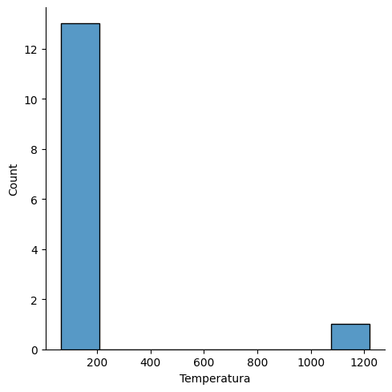

# Exercício de Tratamento de Dados em Python (Jupyter Notebook)

[](LICENSE)
[]()
[]()
[]()
[]()
[]()


## Descrição
Este projeto foi desenvolvido durante o curso *Formação Cientista de Dados* e tem como objetivo:
- Tratar anomalias em dados fora do padrão.
- Corrigir valores ausentes (NA's).
- Analisar dados estatísticos (média, mediana, desvio padrão, etc.).
- Criar gráficos exploratórios para melhor visualização.

O código foi feito em **Python 3.11.9**, utilizando **Pandas**, **Seaborn** e **Statistics** no Jupyter Notebook.

## Tecnologias utilizadas
- Python 3.11.9
- Pandas
- Seaborn
- Jupyter Notebook
- Microsoft Excel

## Pré-requisitos
- Python 3.11.9 ou superior
- Jupyter Notebook ou JupyterLab

## Instalação
Certifique-se de ter o Python 3.11.9 ou superior instalado.  
Em seguida, instale as dependências com:

```bash
pip install pandas seaborn
```

## Como usar
1. Coloque o arquivo `.csv` na mesma pasta do código.
2. Abra o Jupyter Notebook.
3. Execute as células em ordem.

## Exemplo de Dados
| Temperatura | Umidade | Aparência | Jogar |
|-------------|---------|-----------|-------|
| 85          | 85      | sol       | não   |
| 80          | 90      | chuva     | sim   |

## Exemplo de Visualização


## Estrutura do projeto
- `Limpeza e tratamento de Dados - Prática em Python.ipynb` → código principal
- `tempo.csv` → dataset de exemplo
- `README.md` → instruções do projeto

## Próximos passos
- Adicionar mais visualizações.
- Implementar tratamento automático de outliers.
- Criar versão em Power BI para comparação.

## Licença
## Licença
Este projeto está licenciado sob a Licença MIT - veja o arquivo [LICENSE](LICENSE) para mais detalhes.


## Autor
- [Lukas Monteiro](https://github.com/Lukasmonteiro24) ✨


